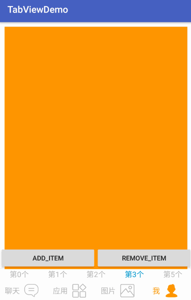

# Android Tab_Navigator

Android首页底部常用tab切换控件,借鉴了`Adapter`和`AdapterView`的写法,可动态增减tab
可配合 `ExpandableLayout`,快速实现 下拉筛选菜单。

## Features

> `TabGroup` ： 类似于 `RadioGroup` ，它们的  `API` 基本相同 <br>
> `TabGroup` ： 继承自 `LinearLayoutCompat`,支持配置 `divider` <br>
> `TabView`  ： 类似于 `CompoundButton` ，实现了 `checkable` <br>
> `ExpandableRelativeLayout` : 一个可 `expandable` 的 `RelativeLayout`.

> `TabContainer` ： 继承自`TabGroup`, 使用了 `Adapter` 模式，对应`getView`方法，可以动态增减`TabView` 。
> `ExpandableContainer` ：  继承自 `ExpandableRelativeLayout`，使用了 `Adapter` 模式，对应`getDropView`方法。
> `DropDownMenu` ： 包含了 `TabContainer`和`ExpandableContainer`，用以实现下拉筛选菜单功能。


## Quick Overview



## Simple
- xml

```
<com.bobomee.android.navigator.dropdown.TabContainer
      android:id="@+id/tab_container1"
      android:layout_width="match_parent"
      android:layout_height="50dp"
      android:layout_alignParentBottom="true"
      android:background="@android:color/white"
      android:elevation="10dp"
      />
```

- code

```
mTabContainer1.setTabAdapter(new AdapterBase<String>(mTitles) {
      @Override public View getView(int position, ViewGroup parent, String object) {
        ItemTabView itemTabView = new ItemTabView(getApplicationContext());

        itemTabView.setText(object);
        itemTabView.setId(position);

        return itemTabView;
      }
   });    
```

## Extend


```java
mDropDownMenu.setTabAdapter(new AdapterDropBase<String>(mTitles) {
      // tabview 的 getView 方法。
      @Override public View getView(int position, ViewGroup parent, String object) {
        DropTabView dropdownButton = new DropTabView(getApplicationContext());

        dropdownButton.setText(object);
        dropdownButton.setId(position);
        // 添加 tabView 的 check 状态监听器 。
        dropdownButton.addOnCheckedChangeListener(new OnTabViewCheckedChangeListener() {
          @Override public void onCheckedChange(ITabView tabView, boolean isChecked) {
            TabView lTabView = (TabView) tabView;
            ViewGroup lViewGroup = (ViewGroup) lTabView.getParent();
            int index = lViewGroup.indexOfChild(lTabView);

            Log.d("BoBoMEe", "Tab CheckedChange, index :  " + index + " ,isChecked : " + isChecked);
          }
        });

        dropdownButton.removeOnCheckedChangeListener(new OnTabViewCheckedChangeListener() {
          @Override public void onCheckedChange(ITabView tabView, boolean isChecked) {

          }
        });

        return dropdownButton;
      }
      // 下拉菜单的 getView 方法。
      @Override public View getDropView(int position, ViewGroup parent, String object) {

        TextView inflate =
            (TextView) View.inflate(DropDownMenu_Activity.this, R.layout.drop_down_text_layout,
                null);

        inflate.setText(getResources().getString(R.string.drop_content) +"\n"+ String.valueOf(position));

        return inflate;
      }
    });
    
    // 设置初始状态 为 收缩状态
    mDropDownMenu.setExpanded(false);

    TabContainer lTabContainer = mDropDownMenu.getTabContainer();
    ExpandableContainer lExpandableRelativeLayout = mDropDownMenu.getExpandableRelativeLayout();

    // 添加 状态 监听器
    lExpandableRelativeLayout.addExpandableLayoutListener(new ExpandableLayoutListenerAdapter() {
      @Override public void onAnimationEnd() {
        super.onAnimationEnd();
        Log.d("BoBoMEe", "onAnimationEnd: ");
      }

      @Override public void onAnimationStart() {
        super.onAnimationStart();
        Log.d("BoBoMEe", "onAnimationStart: ");
      }

      @Override public void onClosed() {
        super.onClosed();
        Log.d("BoBoMEe", "onClosed: ");
      }

      @Override public void onOpened() {
        super.onOpened();
        Log.d("BoBoMEe", "onOpened: ");
      }

      @Override public void onPreClose() {
        super.onPreClose();
        Log.d("BoBoMEe", "onPreClose: ");
      }

      @Override public void onPreOpen() {
        super.onPreOpen();
        Log.d("BoBoMEe", "onPreOpen: ");
      }
    });

    lExpandableRelativeLayout.removeExpandableLayoutListener(new ExpandableLayoutListenerAdapter() {
    });

    /// 添加 Container 的 check 状态监听器
    lTabContainer.addOnCheckedChangeListener((group, checkedId) -> {

      TabGroup tabGroup = (TabGroup) group;
      TabView tabview = (TabView) tabGroup.findViewById(checkedId);
      int index = tabGroup.indexOfChild(tabview);
      boolean lChecked = tabview.isChecked();

      Log.d("BoBoMEe", "Container CheckedChange , index : " + index + " , lChecked : " + lChecked);
    });

    lTabContainer.removeOnCheckedChangeListener((group, checkedId) -> {

    });

    // 设置 Container 的 布局监听器
    lTabContainer.setOnHierarchyChangeListener(new OnHierarchyChangeListener() {
      @Override public void onChildViewAdded(View parent, View child) {
        Log.d("BoBoMEe", "onChildViewAdded: ");
      }

      @Override public void onChildViewRemoved(View parent, View child) {
        Log.d("BoBoMEe", "onChildViewRemoved: ");
      }
    });

    mDropDownMenu.getViewTreeObserver().addOnGlobalLayoutListener(new OnGlobalLayoutListener() {
      @Override public void onGlobalLayout() {
        if (Build.VERSION.SDK_INT < Build.VERSION_CODES.JELLY_BEAN) {
          mDropDownMenu.getViewTreeObserver().removeGlobalOnLayoutListener(this);
        } else {
          mDropDownMenu.getViewTreeObserver().removeOnGlobalLayoutListener(this);
        }
        // 设置下拉菜单 初始状态
        lTabContainer.setCheckedStateForView(true, 0);
        lExpandableRelativeLayout.checkState(0, true);
      }
    });
```


## Thanks

[isanwenyu/TabView](https://github.com/isanwenyu/TabView)
[aakira/ExpandableLayout](https://github.com/aakira/ExpandableLayout)


## TODO

- Jcenter
 
## License

    Copyright 2016 BoBoMEe(wbwjx115@gmail.com)

    Licensed under the Apache License, Version 2.0 (the "License");
    you may not use this file except in compliance with the License.
    You may obtain a copy of the License at

       http://www.apache.org/licenses/LICENSE-2.0

    Unless required by applicable law or agreed to in writing, software
    distributed under the License is distributed on an "AS IS" BASIS,
    WITHOUT WARRANTIES OR CONDITIONS OF ANY KIND, either express or implied.
    See the License for the specific language governing permissions and
    limitations under the License.
