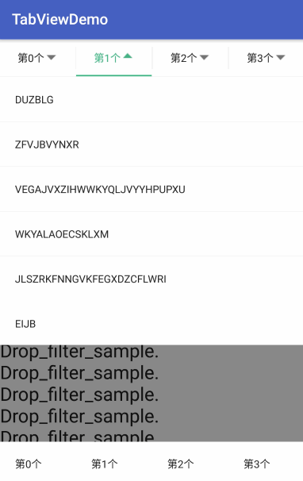

# Android Tab_Navigator

Android首页底部常用tab切换控件,借鉴了`Adapter`和`AdapterView`的写法,可动态增减tab
可配合 `ExpandableLayout`,快速实现 `下拉筛选` 菜单。

## Features

- `TabGroup` ： 继承自 `LinearLayoutCompat`,支持配置 `divider`,类似于 `RadioGroup` ，它们的  `API` 基本相同 <br>
- `TabView`  ： 类似于 `CompoundButton` ，实现了 `checkable` <br>
- `ExpandableRelativeLayout` : 一个可 `expandable` 的 `RelativeLayout`.


- `TabContainer` ： 继承自`TabGroup`, 使用了 `Adapter` 模式，对应`getView`方法，可以动态增减`TabView` 。
- `ExpandableContainer` ：  继承自 `ExpandableRelativeLayout`，使用了 `Adapter` 模式，对应`getDropView`方法。
- `DropDownMenu` ： 包含了 `TabContainer`和`ExpandableContainer`，用以实现下拉筛选菜单功能。

## Quick Overview

  <br/>


## Import

```groovy
compile 'com.bobomee.android:navigator:1.6'
```

## Simple

- xml

```
<com.bobomee.android.navigator.dropdown.TabContainer
      android:id="@+id/tab_container1"
      android:layout_width="match_parent"
      android:layout_height="50dp"
      android:layout_alignParentBottom="true"
      android:background="@android:color/white"
      android:elevation="10dp"
      />
```

- code

```
mTabContainer1.setTabAdapter(new AdapterBase<String>(mTitles) {
      @Override public View getView(int position, ViewGroup parent, String object) {
        ItemTabView itemTabView = new ItemTabView(getApplicationContext());

        itemTabView.setText(object);
        itemTabView.setId(position);

        return itemTabView;
      }
   });    
```

## DropdownMenu

```java
mDropDownMenu.setTabAdapter(new AdapterDropBase<String>(mTitles) {
      @Override public View getView(int position, ViewGroup parent, String object) {
        return tabView;
      }

      @Override public View getDropView(int position, ViewGroup parent, String object) {
        return dropDownView;
      }
    });
    
mDropDownMenu.addDropDownMenuCheckedListener(new DropDownMenuCheckedListener() {
      @Override public void onCheckedChange(int position, boolean checked) {
        Log.d("BoBoMEe", "onCheckedChange: pos : " + position + ", checked: " + checked);
// get cheaked data or set tabview
      }
    });
    
//set the init state
mDropDownMenu.setExpanded(0, true);
```

- 全部API用法Demo： [DropDownMenu_Activity.java](https://github.com/BoBoMEe/Tab_Navigator/blob/master/app/src/main/java/com/bobomee/android/tab_navigator/DropDownMenu_Activity.java)


## Thanks

- [isanwenyu/TabView](https://github.com/isanwenyu/TabView)

- [aakira/ExpandableLayout](https://github.com/aakira/ExpandableLayout)

 
## License

    Copyright 2016 BoBoMEe(wbwjx115@gmail.com)

    Licensed under the Apache License, Version 2.0 (the "License");
    you may not use this file except in compliance with the License.
    You may obtain a copy of the License at

       http://www.apache.org/licenses/LICENSE-2.0

    Unless required by applicable law or agreed to in writing, software
    distributed under the License is distributed on an "AS IS" BASIS,
    WITHOUT WARRANTIES OR CONDITIONS OF ANY KIND, either express or implied.
    See the License for the specific language governing permissions and
    limitations under the License.
